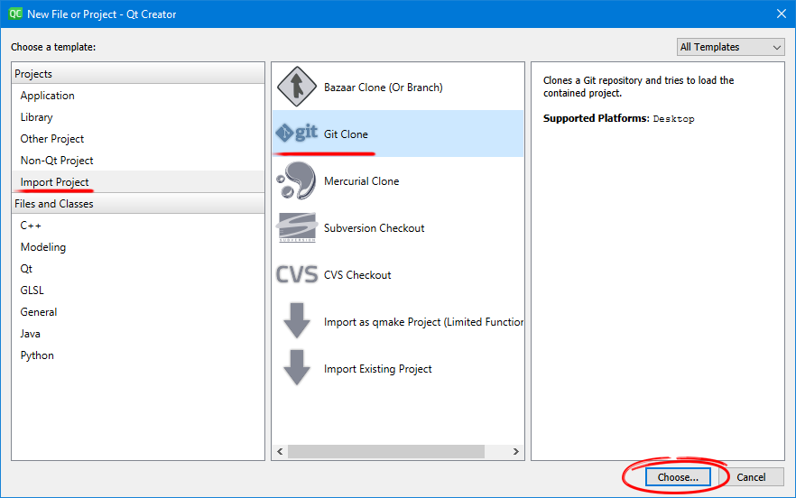
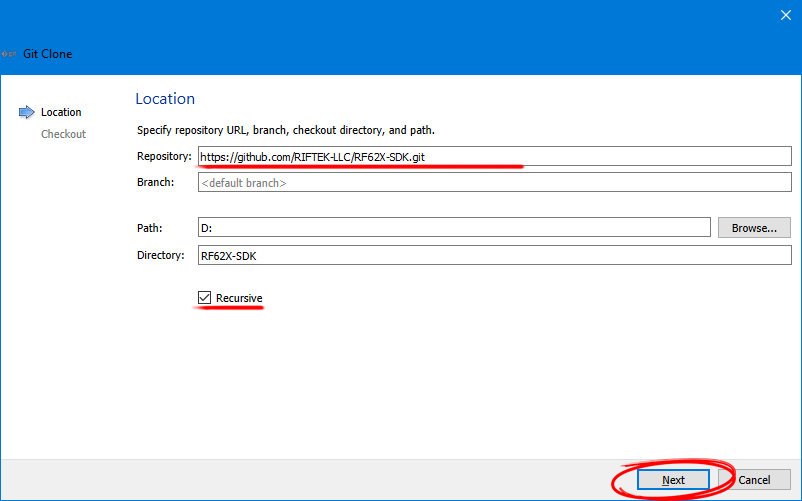
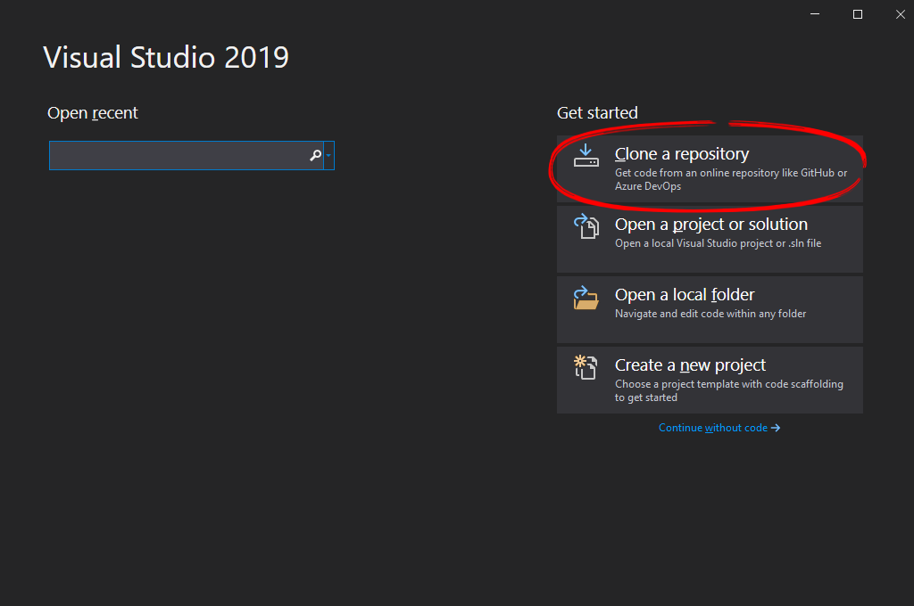
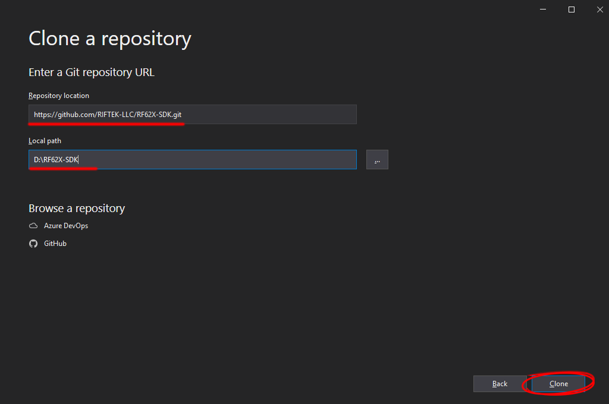

.. _clone_rf62x_sdk:

*******************************************************************************
Скачивание проекта
*******************************************************************************

Git-клиент
===============================================================================

Для разработчиков, которые хотят скачать библиотеку из исходников с помощью 
Git-клиента, следует выполнить следующие инструкции:

*  **Установите git-клиент на свой локальный компьютер (если ещё не установлен)**
    
    -  В Linux используйте команду терминала: ``sudo apt install git``
    -  На MacOS используйте команду терминала: ``brew install git``
    -  Для других платформ смотрите `документацию по установке git-клиента <https://git-scm.com/downloads>`__.

*  **Откройте командную строку/терминал на вашем компьютере**
    
    - В Linux щелкните панель запуска и найдите `terminal`
    - В OS X нажмите command-space и найдите `terminal`
    - В Windows нажмите меню «Пуск» и найдите «командную строку» - `cmd`.

*  **Клонируйте репозиторий с помощью следующих команд:**

    .. code-block:: bash
    
        git clone https://github.com/RIFTEK-LLC/RF62X-SDK.git
        cd RF62X-SDK
        git submodule update --init --recursive

Git в Qt Creator
===============================================================================

Для разработчиков, которые хотят скачать и собрать библиотеку из исходников с 
помощью Git, встроенного в IDE Qt Creator, следует выполнить следующие инструкции:

1. Нажмите **File > New File or Project**

2. Выберите опцию **Import Project > Git Clone**, как показано ниже.

3. Введите url-адрес SDK ``https://github.com/RIFTEK-LLC/RF62X-SDK.git``, 
   выберите опцию **«Recursive»**, а затем нажмите **Next**.

4. После загрузки откройте файл CMakeLists.txt необходимого вам проекта  
   через **File > Open File or Project**, выберите компилятор (*MinGW, MSVC, Clang*)
   и нажмите **Configure Project**

5. Запустите компиляцию проекта

Git в Visual Studio
===============================================================================

Для разработчиков, которые хотят скачать и собрать библиотеку из исходников с 
помощью Git, встроенного в IDE Visual Studio, следует выполнить следующие инструкции:

1. Откройте Visual Studio 2019.

2. В стартовом окне выберите **Клонирование или извлечение кода**.

3. Введите url-адрес SDK ``https://github.com/RIFTEK-LLC/RF62X-SDK.git``,
   выберите или введите местоположение хранилища, а затем нажмите **Клонировать**.

4. После чего Visual Studio загрузит проект из удаленного репозитория и откроет его.

5. Выберите один из необходимых вам проектов и запустите его сборку.

.. note:: Для сборки библиотек **на языке С++**, а также компиляции приложений с примерами их использования в Visual Studio 
   должен быть установлен `C++ CMake tools для Windows <https://docs.microsoft.com/en-us/cpp/build/cmake-projects-in-visual-studio?view=vs-2019>`__.

