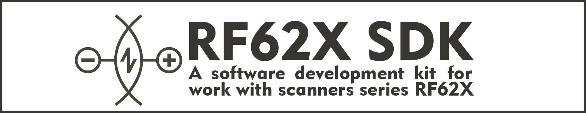

-------------------------------------------------------------------------------

===============================================================================
Набор программных средств для работы с лазерными сканерами серии RF62X
===============================================================================

*******************************************************************************
Подготовка к работе
*******************************************************************************

.. toctree::
   :maxdepth: 2
   :caption: Подготовка к работе

   1.getting_started/1.overview
   1.getting_started/2.compatibility
   1.getting_started/3.preinstall_and_setup
   1.getting_started/4.loading_sdk
   1.getting_started/5.running_sdk_examples
   sdk_compilation/_index
   .. additional_info

*******************************************************************************
Создание проекта
*******************************************************************************

.. toctree::
   :maxdepth: 2
   :caption: Создание проекта

   2.creating_project/cpp
   2.creating_project/csharp
   2.creating_project/python

*******************************************************************************
Компиляция SDK
*******************************************************************************

.. toctree::
   :maxdepth: 2
   :caption: Компиляция SDK

   3.sdk_compilation/RF62XCore
   3.sdk_compilation/RF62XSDK_c
   3.sdk_compilation/RF62XSDK_cpp
   3.sdk_compilation/RF62XSDK_csharp
  
*******************************************************************************
Описания API
*******************************************************************************

.. toctree::
   :maxdepth: 2
   :caption: Описания API
   
   .. 4.api_description/rf62Xcore
   .. 4.api_description/rf62Xsdk_c/_index
   4.api_description/rf62Xsdk_cpp/_index
   .. 4.api_description/rf62Xsdk_csharp/_index
   .. 4.api_description/rf62Xsdk_python/_index

*******************************************************************************
Примеры использования
*******************************************************************************

.. toctree::
   :maxdepth: 2
   :caption: Примеры использования

   tutorial/doxygen
   tutorial/rf62Xsdk_c
   tutorial/rf62Xsdk_cpp
   tutorial/rf62Xsdk_csharp
   tutorial/rf62Xsdk_python
   tutorial/rf62Xsdk_labview
   tutorial/rf62Xsdk_matlab

-------------------------------------------------------------------------------

.. |date| date:: %d/%m/%Y

+-------------------+-------------------------------------------------------------+
| Документация      | `www.riftek.com <https://riftek.com>`__                     |
+-------------------+-------------------------------------------------------------+
| Website           | `www.riftek.com <https://riftek.com>`__                     |
+-------------------+-------------------------------------------------------------+
| Версия документа  | 2.0.0 от |date|                                             |
+-------------------+-------------------------------------------------------------+
| Версии библиотеки | 2.18.1 от |date|                                             |
+-------------------+-------------------------------------------------------------+
