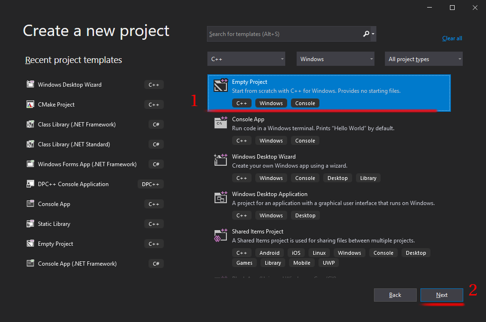
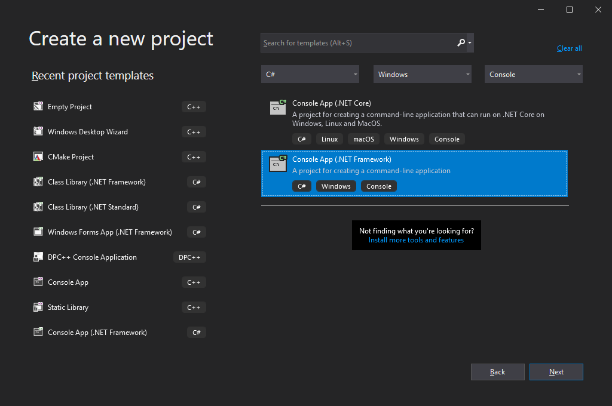

***

***

## CONTENTS
- [OVERVIEW](#overview)
- [GETTING STARTED](#getting-started)
  - [Download project](#download-project)
  - [Running SDK examples](#running-sdk-examples)
- [CREATING PROJECT](#creating-project)
  - [Creating a C/C++ project](#creating-a-cc-project)
  - [Creating a C# project](#creating-a-c-project)
  - [Creating a Python project](#creating-a-python-project)
- [COMPILING RF62X-SDK](#compiling-rf62x-sdk)
  - [COMPILING CORE LIBRARY](#compiling-core-library)
  - [COMPILING WRAPPER LIBRARIES](compiling-wrapper-libraries)
    - [C WRAPPER](#c-wrapper)
    - [C++ WRAPPER](#cc-wrapper)
    - [.NET WRAPPER](#net-wrapper)
    - [PYTHON WRAPPER](#python-wrapper)


## OVERVIEW

**RF62X-SDK** a Software Development Kit that allows specialists to create their own 
software for working with laser scanners RF62X (RF627-old, RF627-smart) series 
manufactured by RIFTEK LLC.

The RF62X-SDK consists of two parts:
* **RF62X-CORE** - the main library («Core») with a basic set of functions and types for working
with laser scanners of the RF62X series. The library is written in the C programming language
in accordance with the C99 standard (ISO/IEC 9899:1999) and is crossplatform. To use
this library, it is necessary to implement platform-dependent functions (working with memory,
working with the network, input/output functions).
* **RF62X-WRAPPERS** - «wrapper»-libraries, in which platform-dependent «Core» functions
for a specific platform are already implemented. The use of wrapper libraries simplifies
the process of developing applications in the following programming languages: C++, С#, 
Python, LabVew, MatLab.


## GETTING STARTED

Developers who want to use **ready-made RF62X-SDK** libraries when creating their own applications
for working with laser scanners of the RF62X series can download the latest libraries (download the 
[RF62X-SDK libraries](#https://gitlab.com/riftek_llc/software/sdk/scanners/RF62X-SDK/-/releases/) 
for C, C++, C#, Python), as well as see examples of their use (see [Examples for C/C++](#creating-a-cc-project), 
[Examples for C#](#creating-a-c-project), [Examples for Python](#creating-a-python-project)).

Developers who prefer to compile RF62X-SDK libraries from sources, the manual contains instructions 
for downloading sources (see [Download project](#download-project)) and installing the necessary software.

### Download project 

For developers who want to download the library from source using the Git-client,
follow these instructions:
##### 1. Install the git-client on your local computer (if not already installed):
* On Linux, use the terminal command: `sudo apt install git`
* On MacOS, use the terminal command: `brew install git`
* For other platforms see [git installation documentation](#).
##### 2. Open a command prompt/terminal on your computer:
* On Linux, click on the launchpad and look for «terminal» `terminal`
* In OS X, press commandspace and find «terminal» `terminal`
* On Windows, click the Start menu and find the «command line» `cmd`.
##### 3. Download the project:
```bash
git clone https://gitlab.com/riftek_llc/software/sdk/scanners/RF62X-SDK.git
cd RF62X-SDK
```
##### 4. Select the right SDK version:
* For work with RF62X-old scanners:
```bash
git checkout v1.x.x
git submodule update --init --recursive
```
* For work with RF62X-smart scanners:
```bash
git checkout v2.x.x
git submodule update --init --recursive
```

> We recommend to use a git client for downloading and Qt Creator for project building 

### Running SDK examples
Here a basic example how to use method for searching RF62X devices in different languages by different ways.\
You can create a new project yourself or you can just open an existing project example and build it.

#### Running a C/C++ example
##### 1) Open and compile examples project in **Qt Creator**:  
*  Load the CMakeLists.txt file from the **examples/C/RF627_old/RF627_search** or **examples/Cpp/RF627_old/RF627_search** 
folder via **File > Open File or Project** (Select the CMakeLists.txt file)
*  Select compiler (MinGW, MSVC2017, Clang, etc..) and click **Configure Project**
*  Compile and Run it
##### 2) Create project and compile examples in **Visual Studio 2019**:  
*  Being in the folder **examples/C/RF627_old/RF627_search** or **examples/Cpp/RF627_old/RF627_search** enter the following command 
into the console (terminal):  
```bash
mkdir build
cd build
cmake ..
```
*  Open the resulting RF627_search.sln solution in Visual Studio
*  Compile and Run it

#### Running a C\# example
##### Open and compile examples project in **Visual Studio 2019**:  
*  Open **RF627_TESTS.sln** from the **examples/CSharp/RF627_old** folder with Visual Studio
*  Select **x64 Debug** or **x64 Release** target platform
*  Add the **rf62Xsdk.dll** C# WRAPPER library to project's **references** 
*  Copy the **rf62Xcore.dll** (see RF62X CORE table from [RF62X-SDK libraries](#) link) into the path of the project executable (**../bin/x64/Debug/** or **../bin/x64/Release/**)
*  Compile project

#### Running a Python example
##### Open and compile examples project in **Visual Studio Code**:  
*  Open **demo.py** or **gui.py** from the **examples/Python/RF627_old** folder with Visual Studio Code
*  Copy the **C WRAPPER rf62Xsdk.dll** (see C WRAPPER table from [RF62X-SDK libraries](#) link) into the path of the project executable
*  Run example

## CREATING PROJECT
### Creating a C/C++ project 
#### 1) Create a new project in **Qt Creator** by CMake with using SDK-sources 
*  Open **File > New File or Project**, select **Qt Console Application** and click **Choose** button


*  Enter project name, Browse project location and click **Next** button
*  Choose **CMake** build system and click **Next** button twice
*  Select one of 64bit compilers (MinGW, MSVC2017, Clang, etc..), click **Next** button and finish project setup.
*  Download the project:
```bash
git clone https://gitlab.com/riftek_llc/software/sdk/scanners/RF62X-SDK.git
cd RF62X-SDK
```
*  Select the right SDK version:
For work with RF62X-old scanners:
```bash
git checkout v1.x.x
git submodule update --init --recursive
```
For work with RF62X-smart scanners:
```bash
git checkout v2.x.x
git submodule update --init --recursive
```
*  Modify your **CMakeLists.txt** file according to the example below and and update RF62XSDK_DIR according to your path to rf62Xwrappers/Cpp/rf62Xsdk:
```cmake
cmake_minimum_required(VERSION 3.5)


##
## PROJECT
## name and version
##
project(RF627_search LANGUAGES CXX)


##
## CONFIGURATION
##
set(CMAKE_INCLUDE_CURRENT_DIR ON)
set(CMAKE_CXX_STANDARD 11)
set(CMAKE_CXX_STANDARD_REQUIRED ON)

# creating output directory architecture in accordance with GNU guidelines
set(BINARY_DIR "${CMAKE_BINARY_DIR}")
set(CMAKE_RUNTIME_OUTPUT_DIRECTORY "${BINARY_DIR}/bin")
set(CMAKE_LIBRARY_OUTPUT_DIRECTORY "${BINARY_DIR}/lib")


# create glob files for *.h, *.cpp
file (GLOB H_FILES   ${CMAKE_CURRENT_SOURCE_DIR}/*.h)
file (GLOB CPP_FILES ${CMAKE_CURRENT_SOURCE_DIR}/*.cpp)
# concatenate the results (glob files) to variable
set  (SOURCES ${CPP_FILES} ${H_FILES})


##
## TARGET
## create target and add include path
##
add_executable(${PROJECT_NAME} ${SOURCES})

# set rf62Xsdk path variable
set(RF62XSDK_DIR "path/to/RF62X-SDK/rf62Xwrappers/Cpp/rf62Xsdk")
# add subdirectory of rf627sdk lib
add_subdirectory(${RF62XSDK_DIR} rf62Xsdk)
target_link_libraries(${PROJECT_NAME} rf62Xsdk)
```
*  Modify your **main.cpp** file according to the example below:

```c++
#include "rf62Xsdk.h"
#include "rf62Xtypes.h"
#include <string>
#include <iostream>

using namespace SDK::SCANNERS::RF62X;

int main()
{

    // Initialize sdk library
    sdk_init();

    // Print return rf627 sdk version
    std::cout << "SDK version: " << sdk_version()                << std::endl;
    std::cout << "========================================="     << std::endl;


    // Create value for scanners vector's type
    std::vector<rf627old*> list;
    // Search for RF627old devices over network
    list = rf627old::search(PROTOCOLS::SERVICE);


    // Print count of discovered rf627-old in network by Service Protocol
    std::cout << "Discovered: " << list.size() << " rf627-old"   << std::endl;


    for (size_t i = 0; i < list.size(); i++)
    {
        rf627old::hello_info info = list[i]->get_info();

        std::cout << "\n\n\nID scanner's list: " << i            << std::endl;
        std::cout << "-----------------------------------------" << std::endl;
        std::cout << "Device information: "                      << std::endl;
        std::cout << "* Name\t: "     << info.device_name()      << std::endl;
        std::cout << "* Serial\t: "   << info.serial_number()    << std::endl;
        std::cout << "* IP Addr\t: "  << info.ip_address()       << std::endl;
        std::cout << "* MAC Addr\t: " << info.mac_address()      << std::endl;

        std::cout << "\nWorking ranges: "                        << std::endl;
        std::cout << "* Zsmr, mm\t: " << info.z_smr()            << std::endl;
        std::cout << "* Zmr , mm\t: " << info.z_mr()             << std::endl;
        std::cout << "* Xsmr, mm\t: " << info.x_smr()            << std::endl;
        std::cout << "* Xemr, mm\t: " << info.x_emr()            << std::endl;

        std::cout << "\nVersions: "                              << std::endl;
        std::cout << "* Firmware\t: " << info.firmware_version() << std::endl;
        std::cout << "* Hardware\t: " << info.hardware_version() << std::endl;
        std::cout << "-----------------------------------------" << std::endl;

    }

    // Cleanup resources allocated with sdk_init()
    sdk_cleanup();
}
```
*  Select **Debug** or **Release** build type, Run CMake and Run project 

#### 2) Create a new project in **Qt Creator** by CMake with using shared(static) SDK-library
*  Open **File > New File or Project**, select **Qt Console Application** and click **Choose** button


*  Enter project name, Browse project location and click **Next** button
*  Choose **CMake** build system and click **Next** button twice
*  Select one of 64bit compilers (MinGW, MSVC2017, Clang, etc..), click **Next** button and finish project setup.
*  Download **rf62Xsdk.dll** (see C/C++ WRAPPER table from [RF62X-SDK libraries](#) link) and **include.zip** archive into the project directory.


*  Modify your **CMakeLists.txt** file according to the example below:
```cmake
cmake_minimum_required(VERSION 3.5)

project(TestProject LANGUAGES CXX)

set(CMAKE_INCLUDE_CURRENT_DIR ON)
set(CMAKE_CXX_STANDARD 11)
set(CMAKE_CXX_STANDARD_REQUIRED ON)

# include *.h rf62Xsdk files from directory
include_directories("${CMAKE_CURRENT_SOURCE_DIR}/include")

# find rf62Xsdk lib in paths and copy full file name to RF62XSDK_LIBRARY
find_library(
    RF62XSDK_LIBRARY
    rf62Xsdk
    PATHS ${CMAKE_CURRENT_SOURCE_DIR}
    )

# create glob files for *.h, *.c
file(GLOB C_FILES ${CMAKE_CURRENT_SOURCE_DIR}/*.cpp)
file(GLOB H_FILES ${CMAKE_CURRENT_SOURCE_DIR}/*.h)
# concatenate the results (glob files) to variable
set  (SOURCES ${C_FILES} ${H_FILES})


##
## TARGET
## create target and add include path
##
add_executable(${PROJECT_NAME} ${SOURCES})

target_link_libraries(${PROJECT_NAME} ${RF62XSDK_LIBRARY})
```
*  Modify your **main.cpp** file according to the example below:

```c++
#include "rf62Xsdk.h"
#include "rf62Xtypes.h"
#include <string>
#include <iostream>

using namespace SDK::SCANNERS::RF62X;

int main()
{

    // Initialize sdk library
    sdk_init();

    // Print return rf627 sdk version
    std::cout << "SDK version: " << sdk_version()                << std::endl;
    std::cout << "========================================="     << std::endl;


    // Create value for scanners vector's type
    std::vector<rf627old*> list;
    // Search for RF627old devices over network
    list = rf627old::search(PROTOCOLS::SERVICE);


    // Print count of discovered rf627-old in network by Service Protocol
    std::cout << "Discovered: " << list.size() << " rf627-old"   << std::endl;


    for (size_t i = 0; i < list.size(); i++)
    {
        rf627old::hello_info info = list[i]->get_info();

        std::cout << "\n\n\nID scanner's list: " << i            << std::endl;
        std::cout << "-----------------------------------------" << std::endl;
        std::cout << "Device information: "                      << std::endl;
        std::cout << "* Name\t: "     << info.device_name()      << std::endl;
        std::cout << "* Serial\t: "   << info.serial_number()    << std::endl;
        std::cout << "* IP Addr\t: "  << info.ip_address()       << std::endl;
        std::cout << "* MAC Addr\t: " << info.mac_address()      << std::endl;

        std::cout << "\nWorking ranges: "                        << std::endl;
        std::cout << "* Zsmr, mm\t: " << info.z_smr()            << std::endl;
        std::cout << "* Zmr , mm\t: " << info.z_mr()             << std::endl;
        std::cout << "* Xsmr, mm\t: " << info.x_smr()            << std::endl;
        std::cout << "* Xemr, mm\t: " << info.x_emr()            << std::endl;

        std::cout << "\nVersions: "                              << std::endl;
        std::cout << "* Firmware\t: " << info.firmware_version() << std::endl;
        std::cout << "* Hardware\t: " << info.hardware_version() << std::endl;
        std::cout << "-----------------------------------------" << std::endl;

    }

    // Cleanup resources allocated with sdk_init()
    sdk_cleanup();
}
```
*  Also copy **rf62Xsdk.dll** into the path of the project executable (PROJECT_BINARY_DIR)
*  Select **Debug** or **Release** build type, Run CMake and Run project 

#### 3) Create a new project in **Visual Studio 2019** with using shared(static) SDK-library
*  Open Visual Studio and chose **Create a new project**, then select **Empty Project** and click **Next** button



*  Enter project name, Browse project location and click **Next** button
*  Add `main.cpp` file to project and modify it according to the example below:
```c++
#include "rf62Xsdk.h"
#include "rf62Xtypes.h"
#include <string>
#include <iostream>

using namespace SDK::SCANNERS::RF62X;

int main()
{

    // Initialize sdk library
    sdk_init();

    // Print return rf627 sdk version
    std::cout << "SDK version: " << sdk_version()                << std::endl;
    std::cout << "========================================="     << std::endl;


    // Create value for scanners vector's type
    std::vector<rf627old*> list;
    // Search for RF627old devices over network
    list = rf627old::search(PROTOCOLS::SERVICE);


    // Print count of discovered rf627-old in network by Service Protocol
    std::cout << "Discovered: " << list.size() << " rf627-old"   << std::endl;


    for (size_t i = 0; i < list.size(); i++)
    {
        rf627old::hello_info info = list[i]->get_info();

        std::cout << "\n\n\nID scanner's list: " << i            << std::endl;
        std::cout << "-----------------------------------------" << std::endl;
        std::cout << "Device information: "                      << std::endl;
        std::cout << "* Name\t: "     << info.device_name()      << std::endl;
        std::cout << "* Serial\t: "   << info.serial_number()    << std::endl;
        std::cout << "* IP Addr\t: "  << info.ip_address()       << std::endl;
        std::cout << "* MAC Addr\t: " << info.mac_address()      << std::endl;

        std::cout << "\nWorking ranges: "                        << std::endl;
        std::cout << "* Zsmr, mm\t: " << info.z_smr()            << std::endl;
        std::cout << "* Zmr , mm\t: " << info.z_mr()             << std::endl;
        std::cout << "* Xsmr, mm\t: " << info.x_smr()            << std::endl;
        std::cout << "* Xemr, mm\t: " << info.x_emr()            << std::endl;

        std::cout << "\nVersions: "                              << std::endl;
        std::cout << "* Firmware\t: " << info.firmware_version() << std::endl;
        std::cout << "* Hardware\t: " << info.hardware_version() << std::endl;
        std::cout << "-----------------------------------------" << std::endl;

    }

    // Cleanup resources allocated with sdk_init()
    sdk_cleanup();
}
```
*  Select **x64** or **x86** and **Debug** or **Release** target platform
*  Download **rf62Xsdk.dll** and **rf62Xsdk.lib** (see C++ WRAPPER table from [RF62X-SDK libraries](#) link) and **include.zip** archive into the project directory.
*  Open **Project > Properties**, choose **Configuration Properties > VC++ Directories** and add paths of downloaded header files and libraries to **Include Directories** and **Library Directories**.
*  Compile project
*  Copy the **rf62Xsdk.dll** (see RF62X CORE table from [RF62X-SDK libraries](#) link) into the path of the project executable (**../bin/x64/Debug/** or **../bin/x64/Release/**)
*  Run project

### Creating a C\# project 
#### Create a new project in **Visual Studio 2019** with using SDK-libraries
*  Open Visual Studio and chose **Create a new project**, then select **Empty Project** and click **Next** button



*  Enter project name (e.g RF627_search), Browse project location and click **Next** button
*  Modify your **Program.cs** file according to the example below:
```csharp
using System;
using System.Collections.Generic;
using SDK.SCANNERS;

namespace RF627_search
{
    class Program
    {
        static void Main(string[] args)
        {
            // Start initialization of the library core
            RF62X.SdkInit();

            // Print return rf62X sdk version
            Console.WriteLine("SDK version: {0}", RF62X.SdkVersion());
            Console.WriteLine("=========================================");

            // Search for RF627old devices over network
            Console.WriteLine("- Start searching device");
            List<RF62X.RF627old> Scanners = RF62X.RF627old.Search();
            Console.WriteLine("+ {0} scanners detected", Scanners.Count);

            for (int i = 0; i < Scanners.Count; i++)
            {
                RF62X.HelloInfo info = Scanners[i].GetInfo();

                Console.WriteLine("\n\n\nID scanner's list: {0}", i);
                Console.WriteLine("-----------------------------------------");
                Console.WriteLine("Device information: ");
                Console.WriteLine("* Name\t: {0}", info.device_name);
                Console.WriteLine("* Serial\t: {0}", info.serial_number);
                Console.WriteLine("* IP Addr\t: {0}", info.ip_address);
                Console.WriteLine("* MAC Addr\t: {0}", info.mac_address);

                Console.WriteLine("Working ranges: ");
                Console.WriteLine("* Zsmr, mm\t: {0}", info.z_smr);
                Console.WriteLine("* Zmr , mm\t: {0}", info.z_mr);
                Console.WriteLine("* Xsmr, mm\t: {0}", info.x_smr);
                Console.WriteLine("* Xemr, mm\t: {0}", info.x_emr);

                Console.WriteLine("\nVersions: ");
                Console.WriteLine("* Firmware\t: {0}", info.firmware_version);
                Console.WriteLine("* Hardware\t: {0}", info.hardware_version);
                Console.WriteLine("-----------------------------------------");
            }

            Console.WriteLine("{0}Press any key to end \"Search-test\"", Environment.NewLine);
            Console.ReadKey();

            // Cleanup resources allocated with SdkInit()
            RF62X.SdkCleanup();
        }
    }
}
```
*  Select **x64** or **x86** and **Debug** or **Release** target platform
*  Download **rf62Xsdk.dll** and **rf62Xcore.dll** (see C# WRAPPER table from [RF62X-SDK libraries](#) link).
*  Open **Project > Add References**, click **Browse...** button and add downloaded **rf62Xsdk.dll** library.
*  Compile project
*  Copy the **rf62Xsdk.dll** and **rf62Xcore.dll** (see C# WRAPPER table from [RF62X-SDK libraries](#) link) into the path of the project executable (**../bin/x64/Debug/** or **../bin/x64/Release/**)
*  Run project

### Creating a Python project 
#### Create a new project in **Visual Studio Code** with using SDK-libraries
*  Create a project directory and add new **py-file** (e.g demo.py) in this project directory 
*  Download **rf62Xsdk.dll** (see C WRAPPER table from [RF62X-SDK libraries](#) link) and **PYSDK.zip** archive into the project directory.
*  Modify your **py-file** (e.g demo.py) according to the example below:
```python
from PYSDK import const_protocol, const_scanner_type, const_parameter_name, const_old_data_type  # PySDK classes
from PYSDK import rf627_Error, rf627_device  # PySDK classes
from PYSDK import sdk_init, get_sdk_version, search_scanners, select_scanner  # PySDK functions

# ===================== RF627 Python SDK demo ================
# Initialize sdk library
sdk_init()
print('sdk version', get_sdk_version()) # Print sdk version

# ===================== RF627_search =========================
#

# Search for RF627old devices over network
list = search_scanners(protocol=const_protocol.kSERVICE, scanner_type=const_scanner_type.kRF627_OLD)
# Print count of discovered rf627-old in network by Service Protocol
print('Discovered: ', len(list), ' rf627-old')
# Print info of all discovered devices in network by Service Protocol
for i in range(len(list)):
    print('Scanner index : ', i)
    print(list[i])

# Select device by ip. Note: device can be selected by device_name, serial_number, etc. (see select_scanner documentation)
current_scanner=select_scanner(list, ip_address='192.168.1.30')

if current_scanner:
    # Print current_scanner device info
    print('Current scanner info')
    hello = current_scanner.get_info_about_scanner()
    print('Device information fields: ')
    print('* Name\t: ', hello['device_name'])
    print('* Serial\t: ', hello['serial_number'])
    print('* IP Addr\t: ', hello['ip_address'])
    print('* MAC Addr\t: ', hello['mac_address'])
    print('\nWorking ranges:')
    print('* Zsmr, mm\t: ', hello['z_begin'])
    print('* Zmr , mm\t: ', hello['z_range'])
    print('* Xsmr, mm\t: ', hello['x_begin'])
    print('* Xemr, mm\t: ', hello['x_end'])
    print('\nVersions: ')
    print('* Firmware\t: ', hello['firmware_version'])
    print('* Hardware\t: ', hello['hardware_version'])
    print('\n')
```


## COMPILING RF62X-SDK
### CORE LIBRARY
RF62X CORE is the main library with basic functionality for work with scanners and platform dependent methods (such as memory, network, output/input methods, etc.) requiring initialization.
This library was written in C programming language in accordance with C99 Sdandart (ISO/IEC 9899:1999).

RF62X CORE can be built on the console or in an IDE.\
Firstly, you should download the project (if you have already done it, skip next commands)
```bash
git clone https://gitlab.com/riftek_llc/software/sdk/scanners/RF62X-SDK.git
cd RF62X-SDK
```
Then you should select the right SDK version:
For work with RF62X-old scanners:
```bash
git checkout v1.x.x
git submodule update --init --recursive
```
For work with RF62X-smart scanners:
```bash
git checkout v2.x.x
git submodule update --init --recursive
```
> for more information about project downloading steps, see an [overview](#overview)

#### CMake
To build the code:

```bash
cd rf62Xcore
mkdir build
cd build
cmake ..
cmake --build .
```

#### Qt Creator
To build the code:
*  Load the CMakeLists.txt file from the **rf62Xcore** folder via 
**File > Open File or Project** (Select the CMakeLists.txt file)
*  Select compiler (MinGW, MSVC2017, Clang, etc..) and click **Configure Project**
*  Open **Build Settings** and check ***install*** target for **Build Steps** 
*  Compile project

#### Visual Studio
To build the code:

```bash
cd rf62Xcore
mkdir build
cd build
cmake ..
```
*  Open rf62Xcore.sln with Visual Studio
*  Compile

### RF62X WRAPPER LIBRARIES
Wrappers are help to make programs in different languages and for different platforms using the rf62Xcore library easier.

#### C WRAPPER
This project is a C library that simplifies the integration of C 
applications with following scanner series: 
*  RF627-old
*  RF627-smart

RF62X SDK (C) can be built on the console or in an IDE.\
Firstly, you should download the project (if you have already done it, skip next commands)
```bash
git clone https://gitlab.com/riftek_llc/software/sdk/scanners/RF62X-SDK.git
cd RF62X-SDK
```
Then you should select the right SDK version:
For work with RF62X-old scanners:
```bash
git checkout v1.x.x
git submodule update --init --recursive
```
For work with RF62X-smart scanners:
```bash
git checkout v2.x.x
git submodule update --init --recursive
```
> for more information about project downloading steps, see an [overview](#overview)

##### CMake
To build the C wrapper:
```bash
cd rf62Xsdk/C/rf62Xsdk
mkdir build
cd build
cmake ..
cmake --build . 
```

##### Qt Creator
To build the code:
*  Load the CMakeLists.txt file from the **rf62Xsdk/C/rf62Xsdk** folder via 
**File > Open File or Project** (Select the CMakeLists.txt file)
*  Select compiler (MinGW, MSVC2017, Clang, etc..) and click **Configure Project**
*  Compile project

##### Visual Studio
To build the code:
```bash
cd rf62Xsdk/C/rf62Xsdk
mkdir build
cd build
cmake ..
```
*  Open rf62Xsdk.sln with Visual Studio
*  Compile

#### C++ WRAPPER
This project is a C++ library that simplifies the integration of C++ 
applications with following scanner series: 
*  RF627-old
*  RF627-smart

RF62X SDK (C++) can be built on the console or in an IDE.\
Firstly, you should download the project (if you have already done it, skip next commands)
```bash
git clone https://gitlab.com/riftek_llc/software/sdk/scanners/RF62X-SDK.git
cd RF62X-SDK
```
Then you should select the right SDK version:
For work with RF62X-old scanners:
```bash
git checkout v1.x.x
git submodule update --init --recursive
```
For work with RF62X-smart scanners:
```bash
git checkout v2.x.x
git submodule update --init --recursive
```
> for more information about project downloading steps, see an [overview](#overview)

##### CMake
To build the С++ wrapper:
```bash
cd rf62Xsdk/Cpp/rf62Xsdk
mkdir build
cd build
cmake ..
cmake --build . 
```

##### Qt Creator
To build the code:
*  Load the CMakeLists.txt file from the **rf62Xsdk/Cpp/rf62Xsdk** folder via 
**File > Open File or Project** (Select the CMakeLists.txt file)
*  Select compiler (MinGW, MSVC2017, Clang, etc..) and click **Configure Project**
*  Compile project

##### Visual Studio
To build the code:
```bash
cd rf62Xsdk/Cpp/rf62Xsdk
mkdir build
cd build
cmake ..
```
*  Open rf62Xsdk.sln with Visual Studio
*  Compile

#### .NET WRAPPER
This project is a .NET library, written in C# language, that simplifies the integration of C#, 
Visual Basic .NET, C++/CLI and JScript .NET applications with following scanner series: 
*  RF627-old
*  RF627-smart

RF62X SDK (C#) can be built in an Visual Studio IDE.\
Firstly, you should download the project (if you have already done it, skip next commands)
```bash
git clone https://gitlab.com/riftek_llc/software/sdk/scanners/RF62X-SDK.git
cd RF62X-SDK
```
Then you should select the right SDK version:
For work with RF62X-old scanners:
```bash
git checkout v1.x.x
git submodule update --init --recursive
```
For work with RF62X-smart scanners:
```bash
git checkout v2.x.x
git submodule update --init --recursive
```
> for more information about project downloading steps, see an [overview](#overview)

##### Visual Studio
To build the code:

*  Open rf62Xsdk.sln from the **rf62Xsdk/CSharp/RF627_old** folder with Visual Studio
*  Compile

#### PYTHON WRAPPER
This library allows you to simplify the development of Python applications with 
following scanner series: 
*  RF627-old
*  RF627-smart

To use it in Python projects, the developer must include the necessary library py-files in a project,
as well as the dynamic program library rf62Xsdk.dll.\
*  Firstly, you should download the RF62X-SDK project (if you have already done it, skip next commands)
```bash
git clone https://gitlab.com/riftek_llc/software/sdk/scanners/RF62X-SDK.git
cd RF62X-SDK
```
Then you should select the right SDK version:
For work with RF62X-old scanners:
```bash
git checkout v1.x.x
git submodule update --init --recursive
```
For work with RF62X-smart scanners:
```bash
git checkout v2.x.x
git submodule update --init --recursive
```
> for more information about project downloading steps, see an [overview](#overview)

*  To build the rf62Xsdk.dll (C wrapper) you should use one of the previously described 
methods (see [compilation C WRAPPER](#c-wrapper))
*  Copy the resulting rf62Xsdk.dll library, PYSDK.py and PYSDK_functions.py to your own project folder